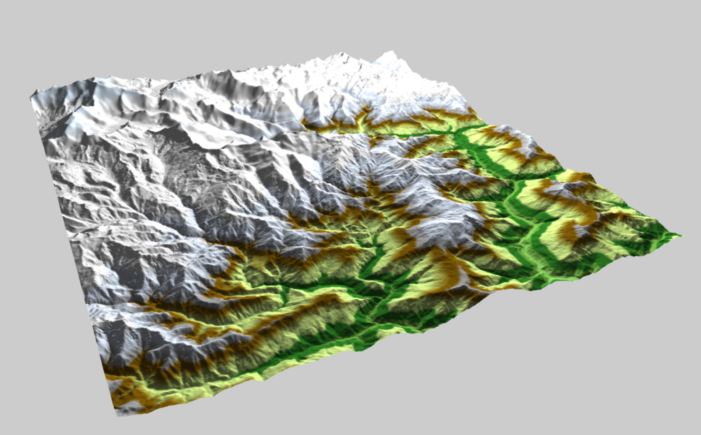

# ThreejsDEM

Once again, I used [Derek Watkins](https://github.com/dwtkns)'s [Tile Grabber](http://dwtkns.com/srtm/) to get DEM data. Those images are originally 16bit (int16) tiff from the [SRTM3](http://www.webgis.com/srtm3.html) that I cropped and converted into json. (More about that project later).

# What is it?
On a way, this project is very close to one I've done earlier: [DTM2MESH](https://github.com/jonathanlurie/DTM2MESH), that converts elevation data into a 3D Collada file. Well, here, instead of converting into a file we are viewing the elevation data into a web browser thanks to webGL.  

The whole visualization part is made with [ThreeJS](http://threejs.org/) but there is a bit of processing to transform 16bit 2D data into a bunch of 3D triangles, this happens in the file [js/JsonDemLoader.js](https://github.com/jonathanlurie/ThreejsDEM/blob/master/js/JsonDemLoader.js).


[LIVE DEMO](http://jonathanlurie.github.io/ThreejsDEM/)  
Note that it may take a while to load and process so it might be easier to try it in local. If you are doing so, you will need to create a http server for loading json files:

```shell
$ git clone https://github.com/jonathanlurie/ThreejsDEM.git
$ cd ThreejsDEM/
$ python -m SimpleHTTPServer
# then go open a browser at http://localhost:8000
```

# Colors

As you can see on the screenshot, I mapped some colors depending on the altitude (in meters), the LUT (or sort of) is [here](https://github.com/jonathanlurie/ThreejsDEM/blob/master/js/JsonDemLoader.js#L274) and can be changed easily.

# Customization
If you clone this repo, you will be able to use different elevation data from different places on the globe. This is also meant to test some performance since some jsonDem are larger that others.  

To change the input data, edit the beginning of the `<script>` from `index.html` (around *[l:54](https://github.com/jonathanlurie/ThreejsDEM/blob/master/index.html#L54)*)

# Interpolation and triangles
To keep this example as simple as possible, I created 2 triangles per pixel, where *x* and *y* from the 2D plane (raster image) is projected on *x* and *z* on the 3D model. The pixel value of the raster (altitude in meters) is projected along the *y* axis, giving the necessary volume.  
Thanks to ThreeJS data structures, I could create a list of vertice and then build all the triangles using the index from within this list. Doing so is more economic than creating independant triangles with 3 new vertices every time since all of them will be used at least 2 times.


# License
MIT (see License file)
